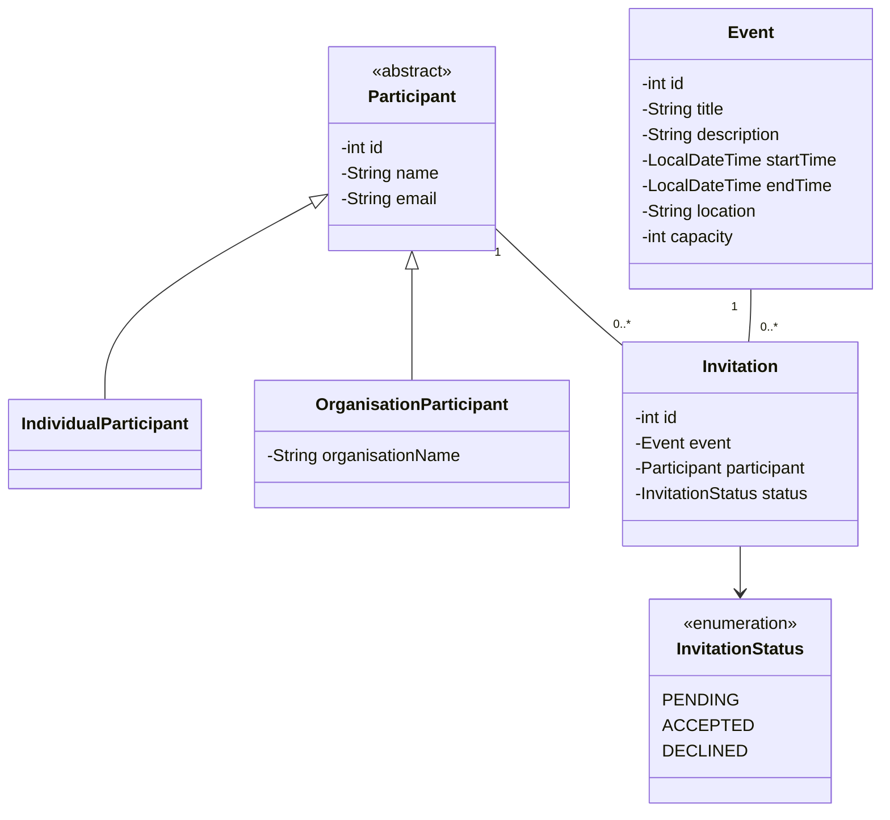

# UML Class Diagram

## The Society of Impossible Occasions

```mermaid
classDiagram
    class Participant {
        <<abstract>>
        -int id
        -String name
        -String email
    }

    class IndividualParticipant {
    }

    class OrganisationParticipant {
        -String organisationName
    }

    class Event {
        -int id
        -String title
        -String description
        -LocalDateTime startTime
        -LocalDateTime endTime
        -String location
        -int capacity
    }

    class Invitation {
        -int id
        -Event event
        -Participant participant
        -InvitationStatus status
    }

    class InvitationStatus {
        <<enumeration>>
        PENDING
        ACCEPTED
        DECLINED
    }

    Participant <|-- IndividualParticipant
    Participant <|-- OrganisationParticipant
    Event "1" -- "0..*" Invitation
    Participant "1" -- "0..*" Invitation
    Invitation --> InvitationStatus
```
